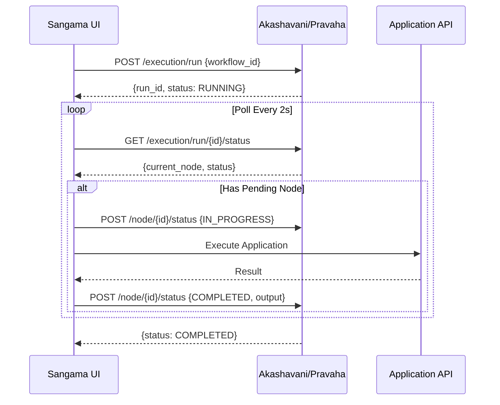

# Workflow Module - Client Documentation

> **💡 Quick Start:** Use **[API Factory](api-factory.md)** to auto-configure workflows! This guide shows workflow design details.

> **🔥 NEW**: Client-driven workflow execution! The client (Sangama UI) now executes nodes and polls for status.

The Workflow module enables building and executing complex multi-step workflows with visual design support.

## Overview

Features:
- **Visual Workflow Design**: Node-based workflow editor (Sangama UI)
- **Multiple Node Types**: Application, Utility, LLM, Environment, Note, Group
- **Client-Driven Execution**: Frontend executes nodes, backend manages state
- **Execution Management**: Track workflow runs and status
- **Retry Logic**: Automatic retry (max 3 attempts)
- **Persistence**: JSON-based workflow storage

## Execution Model (⚡ NEW)

### How It Works

**Client-Driven Execution**: The backend manages state orchestration while the frontend executes nodes.



### Why Client-Driven?

1. **Reuse Existing Logic**: Sangama already has application execution with streaming
2. **Single Source of Truth**: UI handles all data transformations
3. **No Code Duplication**: Backend doesn't need to duplicate frontend logic
4. **Simpler Backend**: Pravaha focuses on state management only

## Workflow Structure

### Workflow Definition

```json
{
  "id": "workflow-uuid",
  "name": "My Workflow",
  "nodes": [
    {
      "id": "node-1",
      "node_type": "APP",  // NEW: enum instead of task_type string
      "task_name": "generate_content",
      "inputs": {
        "topic": {
          "key_name": "topic",
          "source": "direct",
          "value": "AI"
        }
      },
      "position": {"x": 100, "y": 100}
    }
  ],
  "edges": [
    {
      "id": "edge-1",
      "source": "node-llm",
      "target": "node-1"
    }
  ]
}
```

### Node Types

| Type | Category | Executable? | Purpose |
|------|----------|-------------|---------|
| `APPLICATION` | Executable | ✅ | Full domain applications (streaming LLM apps) |
| `UTILITY` | Executable | ✅ | Helper functions, data transforms |
| `LLM` | Configuration | ❌ | Local LLM settings for specific nodes |
| `GLOBAL_LLM` | Configuration | ❌ | Default LLM for entire workflow |
| `ENVIRONMENT` | Configuration | ❌ | Environment variables |
| `NOTE` | UI-only | ❌ | Documentation/comments |
| `GROUP` | UI-only | ❌ | Visual grouping container |

**Only APPLICATION and UTILITY nodes are executed by the client.**

## API Endpoints

### Workflow CRUD (Unchanged)

<details>
<summary><b>POST /api/workflow/create</b> - Create a new workflow</summary>

**Request:**
```json
{
  "name": "My Workflow", 
  "nodes": [...],
  "edges": [...]
}
```

**Response:** Complete workflow object with generated ID
</details>

<details>
<summary><b>GET /api/workflow/list</b> - List all workflows</summary>

Returns array of workflow objects.
</details>

<details>
<summary><b>GET /api/workflow/{workflow_id}</b> - Get workflow by ID</summary>

Returns single workflow object.
</details>

<details>
<summary><b>POST /api/workflow/update</b> - Update existing workflow</summary>

**Request:** Full workflow object with `id` field
</details>

<details>
<summary><b>POST /api/workflow/rename</b> - Rename a workflow</summary>

**Request:**
```json
{
  "id": "workflow-uuid",
  "new_name": "New Workflow Name"
}
```
</details>

<details>
<summary><b>DELETE /api/workflow/{workflow_id}</b> - Delete a workflow</summary>

Returns `{"status": "deleted"}`
</details>

---

### ⚡ NEW: Client-Driven Execution API

#### 1. Start Execution

```http
POST /api/execution/run
Content-Type: application/json

{
  "workflow_id": "uuid-1234"
}
```

**Response:**
```json
{
  "workflow_run_id": "run-uuid-5678",
  "status": "RUNNING"
}
```

**What It Does**: Initializes run state and marks root nodes as `PENDING`.

---

#### 2. Poll Status

```http
GET /api/execution/run/{run_id}/status
```

**Response:**
```json
{
  "run_id": "run-uuid-5678",
  "status": "RUNNING",
  "current_node": {
    "node_id": "node-A",
    "node_type": "APP",
    "task_name": "generate_content",
    "status": "PENDING",
    "retry_count": 0
  },
  "nodes_status": {
    "node-A": "PENDING",
    "node-B": "NEW",
    "node-C": "NEW"
  }
}
```

**What It Does**: 
- Returns next pending node for client to execute
- Checks for stale nodes (orphaned for >5 minutes)
- Returns `null` for `current_node` when workflow complete

**Client Should Poll**: Every 2 seconds

---

#### 3. Update Node Status

```http
POST /api/execution/run/{run_id}/node/{node_id}/status
Content-Type: application/json

{
  "status": "IN_PROGRESS" | "COMPLETED" | "FAILED",
  "output_data": {...},     // Optional, for COMPLETED
  "error": "error message", // Optional, for FAILED
  "retry_attempt": 1        // Optional, triggers retry
}
```

**Response:**
```json
{
  "success": true,
  "run_status": "RUNNING"
}
```

**What It Does**:
- `IN_PROGRESS`: Marks node as executing (client should call before execution)
- `COMPLETED`: Stores output, advances workflow to next node
- `FAILED`: Marks failed, optionally retries (max 3 attempts)

---

#### 4. Get Node Output

```http
GET /api/execution/run/{run_id}/node/{node_id}/output
```

**Response:**
```json
{
  "data": {...},
  "timestamp": "2026-01-12T...",
  "version": 1
}
```

**What It Does**: Retrieves output from a previously completed node (for data dependencies).

---

### Legacy Endpoints (For Compatibility)

<details>
<summary><b>GET /api/workflow/run/{run_id}</b> - Get run details</summary>

Returns full `WorkflowRun` object with all fields.
</details>

<details>
<summary><b>GET /api/workflow/runs?workflow_id={id}</b> - List runs</summary>

Returns array of run objects for a workflow (or all runs if no workflow_id).
</details>

## Setup (For Akashavan Developers)

### Using API Factory (Recommended)

```python
from pravaha.domain.api.factory.api_factory import create_fastapi_app

app = create_fastapi_app(
    bot_manager=bot_manager,
    task_config=task_config,
    storage_manager=storage_manager,
    llm_config_path="config/llm_config.json"
)
```

✅ **Workflows automatically configured!** No additional setup needed.

### Manual Setup (Advanced)

```python
from pravaha.domain.workflow.service.workflow_service import WorkflowService
from pravaha.domain.workflow.infrastructure.json_workflow_repository import JsonWorkflowRepository
from pravaha.domain.workflow.infrastructure.json_run_repository import JsonRunRepository
from pravaha.domain.workflow.service.simple_orchestration_engine import SimpleOrchestrationEngine

# Setup repositories
workflow_repo = JsonWorkflowRepository("data/workflows.json")
run_repo = JsonRunRepository("data/runs.json")

# Setup orchestration engine (state-only, no task executor!)
orchestration_engine = SimpleOrchestrationEngine(run_repo)

# Create service
workflow_service = WorkflowService(
    workflow_repo, 
    run_repo, 
    orchestration_engine
)
```

## Workflow Execution Flow

### State Machine

```
NEW → PENDING → IN_PROGRESS → COMPLETED
                            ↓
                         FAILED (retry → PENDING)
```

**States**:
- `NEW`: Node waiting, dependencies not met
- `PENDING`: Ready to execute, waiting for client pickup
- `IN_PROGRESS`: Client currently executing
- `COMPLETED`: Successfully finished
- `FAILED`: Failed (after max retries)

### Example: 3-Node Linear Workflow

**Workflow**: A → B → C

**Execution Timeline**:

1. **Start**: Client calls `POST /execution/run`
   - Backend marks Node A as `PENDING`
   - Nodes B, C marked as `NEW`

2. **Poll**: Client calls `GET /execution/run/{id}/status`
   - Response: `current_node = Node A`

3. **Execute Node A**:
   - Client: `POST /node/A/status {IN_PROGRESS}`
   - Client: Execute application API
   - Client: `POST /node/A/status {COMPLETED, output}`

4. **Backend Advances**: Node A → `COMPLETED`, Node B → `PENDING`

5. **Repeat for B and C**

6. **Complete**: All nodes `COMPLETED`, run status → `COMPLETED`

## Integration Example (Sangama UI)

### Frontend Execution Loop

```typescript
// useWorkflowExecutionLoop.ts
export const useWorkflowExecutionLoop = (runId: string) => {
  const [status, setStatus] = useState<string>('RUNNING')
  const { handleRun } = useApplicationViewModel() // Existing!

  useEffect(() => {
    const interval = setInterval(async () => {
      // Poll status
      const res = await repo.getExecutionStatus(runId)
      setStatus(res.status)
      
      if (res.current_node?.status === 'PENDING') {
        await executeNode(res.current_node)
      }
      
      if (res.status === 'COMPLETED' || res.status === 'FAILED') {
        clearInterval(interval)
      }
    }, 2000) // Poll every 2s
    
    return () => clearInterval(interval)
  }, [runId])

  const executeNode = async (node: any) => {
    try {
      // Mark in progress
      await repo.updateNodeStatus(runId, node.node_id, {
        status: 'IN_PROGRESS'
      })
      
      // Execute using existing ApplicationViewModel!
      const result = await handleRun(node.inputs, node.llm_config)
      
      // Mark completed
      await repo.updateNodeStatus(runId, node.node_id, {
        status: 'COMPLETED',
        output_data: result
      })
    } catch (error) {
      // Mark failed with retry
      await repo.updateNodeStatus(runId, node.node_id, {
        status: 'FAILED',
        error: error.message,
        retry_attempt: 1 // Triggers retry
      })
    }
  }
  
  return { status }
}
```

## Best Practices

### For Akashavani (Backend)

1. ✅ **Use API Factory**: Simplest setup
2. ✅ **Update Pravaha**: `pip install -e .` after pulling changes
3. ✅ **Monitor Runs**: Check `data/runs.json` for debugging
4. ✅ **Error Handling**: Stale nodes auto-fail after 5 minutes

### For Sangama (Frontend)

1. ✅ **Reuse Existing Logic**: `useApplicationViewModel` already executes apps
2. ✅ **Poll Every 2s**: Don't poll too frequently
3. ✅ **Handle Retries**: Set `retry_attempt` on failures
4. ✅ **Show Progress**: Display node states to user
5. ✅ **Error Feedback**: Show clear error messages from backend

## Troubleshooting

### Run Stuck in "RUNNING"

**Cause**: Client crashed or network issue  
**Solution**: Backend auto-fails nodes IN_PROGRESS >5 minutes

### Node Status "FAILED"

**Causes**:
- Application execution error (check client logs)
- Network timeout
- Stale node detection

**Solution**: Check `error_message` in run object

### No "current_node" Returned

**Causes**:
- All nodes completed (run status = COMPLETED)
- Run failed (run status = FAILED)
- Workflow has no executable nodes

**Solution**: Check `run.status` field

## Migration from Old Server-Side Execution

If you had workflows using old `/api/workflow/run` endpoint:

1. **Old Behavior**: Server executed all nodes automatically
2. **New Behavior**: Client polls and executes nodes

**No Breaking Changes**: Old endpoint still works but redirects to new execution model. However, you need to implement the polling loop in the frontend.

## See Also

- [API Factory Documentation](api-factory.md) - Auto-configuration
- [Bot Module Documentation](bot-module.md) - Application execution
- [Storage Module Documentation](storage-module.md) - File inputs
