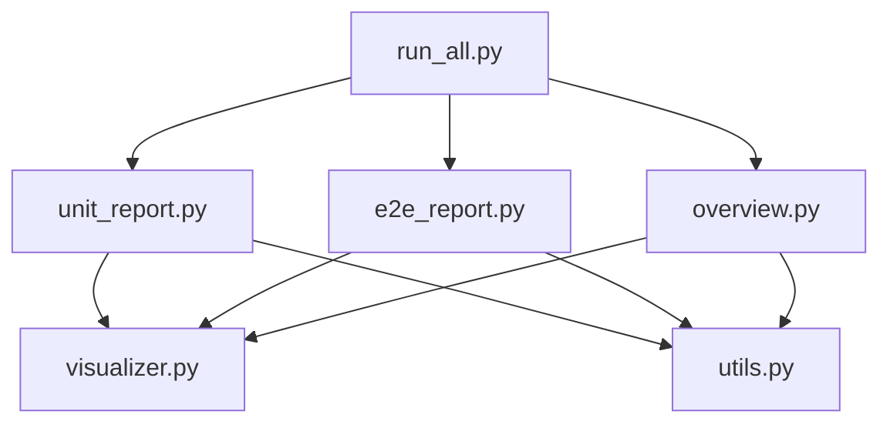

# Test Reporting System Specification

## 1. Overview
The **Pravaha Test Reporting System** is a modular, automated pipeline designed to generate comprehensive, visually enhanced test reports for both Unit and End-to-End (E2E) test suites. It utilizes `pytest` for execution, `seaborn`/`matplotlib` for visualization, and `jinja2`-style string formatting for Markdown rendering.

## 2. Architecture
The system is organized as a Python package under `scripts/reporting/`.

### Modules
- **`run_all.py`**: The **Orchestrator**. Cleans the report directory, triggers unit and E2E reporting sequences, and finally generates the overview dashboard.
- **`unit_report.py`**:
    - Executes `pytest tests/unit`.
    - Collects coverage data from `tests/unit` run against `src/nikhil/pravaha`.
    - Generates Unit-specific visualizations.
    - Renders `unit_report.md` using `unit_report_template.md`.
- **`e2e_report.py`**:
    - Executes `pytest tests/e2e`.
    - Groups scenarios by Domain Module (e.g., Auth, Storage).
    - Generates E2E-specific visualizations.
    - Renders `e2e_report.md` using `e2e_report_template.md`.
- **`overview.py`**:
    - Aggregates metrics from JSON artifacts (`unit.json`, `e2e.json`, `coverage.json`).
    - Generates high-level distribution charts.
    - Renders the main `README.md` dashboard.
- **`visualizer.py`**: Shared plotting library. Enforces consistent styling (`seaborn` theme) and output formats.
- **`utils.py`**: Shared logic for file I/O, JSON parsing, and dynamic module discovery.

## 3. Visualization Strategy
All visualizations are generated as PNG images in the report directory and embedded into Markdown files.

| Report | Plot File | Type | Description |
| :--- | :--- | :--- | :--- |
| **Unit** | `unit_outcomes.png` | Stacked Bar | Pass/Fail/Error counts per module. |
| **Unit** | `unit_coverage.png` | Bar Chart | Code coverage percentage per module. |
| **Unit** | `unit_durations.png` | Histogram | Distribution of test execution times. |
| **E2E** | `e2e_status.png` | Pie Chart | Proportion of Passed vs Failed scenarios. |
| **E2E** | `e2e_durations.png` | Bar Chart | Top 10 slowest scenarios (performance bottlenecks). |
| **Overview** | `distribution_chart.png` | Pie Chart | Global distribution of all tests (Unit + E2E). |

## 4. Templates
Reports are generated using Markdown templates located in `docs/test/templates/`.

### `unit_report_template.md`
- **Module Breakdown**: Table with Coverage % column.
- **Visualizations**: Placeholders for `Outcomes`, `Coverage`, `Durations`.
- **Detailed Results**: Sections injected dynamically per module.

### `e2e_report_template.md`
- **Module Breakdown**: Summary table of E2E scenarios by domain.
- **Visualizations**: Placeholders for `Status` and `Durations`.
- **Detailed Results**: Scenario-level pass/fail logs.

### `overview_report_template.md`
- **Dashboard**: High-level metrics (Pass Rate, Total Duration, Critical Issues).
- **Navigation**: Links to detailed Unit and E2E reports.

## 5. Execution Flow
1. **Clean**: `scripts/reporting/run_all.py` wipes `.Nibandha/Pravaha/Report`.
2. **Unit Phase**:
    - Run `pytest` -> `unit.json`.
    - Run `coverage` -> `coverage.json`.
    - Generate Unit Plots.
    - Render `unit_report.md`.
3. **E2E Phase**:
    - Run `pytest` -> `e2e.json`.
    - Generate E2E Plots.
    - Render `e2e_report.md`.
4. **Overview Phase**:
    - Load all JSONs.
    - Generate Summary Plots.
    - Render `README.md`.
